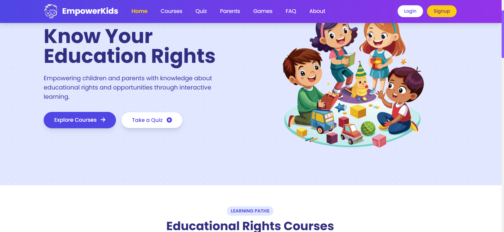
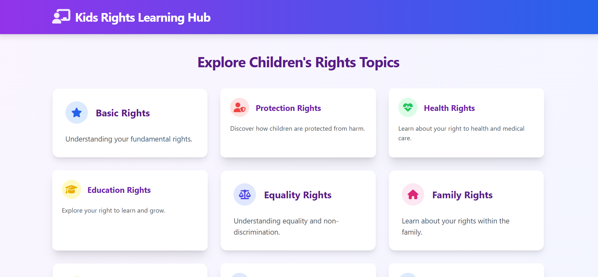

# 🌟 EmpowerKids - Children's Rights Education Platform

<div align="center">
  
  
  [](https://opensource.org/licenses/MIT)
  [](https://developer.mozilla.org/en-US/docs/Web/HTML)
  [](https://tailwindcss.com/)
  [](https://developer.mozilla.org/en-US/docs/Web/JavaScript)
</div>

## 📋 Table of Contents
- [About](#about)
- [Features](#features)
- [Demo](#demo)
- [Installation](#installation)
- [Usage](#usage)
- [Project Structure](#project-structure)
- [Contributing](#contributing)
- [License](#license)
- [Contact](#contact)

## 🎯 About

**EmpowerKids** is a comprehensive gamified platform designed to educate Indian children about their fundamental rights through interactive learning. The platform combines education, awareness, and engagement to create a child-friendly environment for learning about legal rights, education policies, and social responsibilities.

### 🌟 Mission
To empower children and parents with knowledge about educational rights and opportunities through interactive, engaging, and accessible learning experiences.

## ✨ Features

### 🎮 For Children
- **Interactive Learning Modules**: Rights education through games and stories
- **Quiz System**: Multi-level quizzes with scoring and progress tracking
- **Rights Explorer**: Learn about different types of children's rights
- **Progress Tracking**: Personal dashboards with achievements

### 👥 For Parents & Teachers
- **Resource Hub**: Comprehensive guides on RTE Act and education rights
- **Checklist Generator**: School admission and RTE application helpers
- **FAQ Section**: Common questions about education rights
- **Legal Resources**: Access to important documents and guidelines

### 🔧 Platform Features
- **Responsive Design**: Works on all devices
- **User Authentication**: Secure login and registration
- **Progress Tracking**: Save and track learning progress
- **Multi-language Support** (Planned)
- **Offline Access** (Planned)

## 🚀 Demo

### Live Demo
🔗 **[Visit EmpowerKids Platform](https://your-github-username.github.io/empowerkids-platform)**

### Screenshots
<div align="center">
  
  
  
</div>

## 🛠️ Installation

### Prerequisites
- Modern web browser (Chrome, Firefox, Safari, Edge)
- Basic knowledge of HTML/CSS/JavaScript for development

### Quick Start
1. **Clone the repository**
   ```bash
   git clone https://github.com/your-username/empowerkids-platform.git
   cd empowerkids-platform
   ```

2. **Open in browser**
   ```bash
   # Simply open homepage.html in your browser
   # or use a local server
   python -m http.server 8000  # Python
   # or
   npx serve .  # Node.js
   ```

3. **For Development**
   ```bash
   # Install dependencies
   npm install
   
   # Start development server
   npm run dev
   
   # Build CSS
   npm run build
   ```

## 💻 Usage

### Getting Started
1. Visit the platform homepage
2. Create an account or login
3. Choose your learning path:
   - **Children**: Start with Basic Rights course
   - **Parents**: Visit the Parent Resources section
   - **Teachers**: Access Teacher Guidelines

### Navigation Guide
- **Homepage**: Overview and quick access to all features
- **Courses**: Structured learning modules on different rights
- **Quiz**: Test knowledge with interactive quizzes
- **Parents**: Resources for parents and teachers
- **Games**: Educational games and activities

## 📁 Project Structure

```
empowerkids-platform/
│
├── 📄 homepage.html              # Main landing page
├── 📄 pages/
│   ├── 📄 intropage.html        # Welcome/intro page
│   ├── � auth/                 # Authentication pages
│   │   ├── login page.html
│   │   └── singinpage.html
│   ├── 📁 rights/               # Rights education modules
│   │   ├── basic-rights.html
│   │   ├── education-rights.html
│   │   ├── protection-rights.html
│   │   ├── development-rights.html
│   │   ├── participation-rights.html
│   │   ├── equality-rights.html
│   │   ├── digital-rights.html
│   │   ├── health-rights.html
│   │   ├── expression-rights.html
│   │   ├── family-rights.html
│   │   ├── nature-rights.html
│   │   ├── climate-rights.html
│   │   ├── tech-ai-rights.html
│   │   ├── genetic-rights.html
│   │   ├── neuro-rights.html
│   │   ├── quantum-rights.html
│   │   ├── space-rights.html
│   │   ├── war-conflict.html
│   │   ├── balancing-rights.html
│   │   └── rights-dilemmas.html
│   ├── 📁 resources/            # Parent/Teacher resources
│   │   ├── parent.html
│   │   ├── parentsu.html
│   │   ├── teacher.html
│   │   ├── faq.html
│   │   ├── checklist.html
│   │   ├── calculator.html
│   │   └── eligibility.html
│   ├── 📁 activities/           # Games and interactive content
│   │   ├── quiz.html
│   │   ├── games.html
│   │   └── play-culture.html
│   └── 📁 learning/             # Learning modules
│       ├── corusesreal.html     # Course catalog
│       ├── consciousness.html
│       ├── critical-thinking.html
│       ├── global-citizenship.html
│       ├── justice-systems.html
│       └── social-responsibility.html
│
├── 📁 CSS/                      # Stylesheets
│   ├── main.css                 # Unified CSS file
│   ├── input.css                # Tailwind input
│   └── output.css               # Tailwind output
│
├── 📁 js/                       # JavaScript files
│   ├── main.js                  # Core functionality
│   ├── quiz.js                  # Quiz system
│   └── auth.js                  # Authentication
│
├── 📁 assets/                   # Images, videos, icons
│   ├── 503-Kid-Game-Pre-Designed-Logo-removebg-preview.png
│   ├── [educational videos]
│   └── [images and graphics]
│
├── 📁 backend/                  # Backend files
│   ├── dbconfig.php
│   └── login.php
│
├── 📁 docs/                     # Documentation
│   └── DEVELOPMENT.md
│
└── 📄 README.md                 # Project documentation
```

## 🎨 Design System

### Color Palette
- **Primary Purple**: `#8b5cf6`
- **Primary Blue**: `#3b82f6`
- **Accent Yellow**: `#fbbf24`
- **Success Green**: `#10b981`
- **Warning Red**: `#ef4444`

### Typography
- **Primary Font**: Poppins
- **Fallback**: System fonts (ui-sans-serif, system-ui)

## 🚀 Deployment

### GitHub Pages Deployment

1. **Prepare your repository**
   ```bash
   git add .
   git commit -m "Initial commit"
   git push origin main
   ```

2. **Enable GitHub Pages**
   - Go to repository Settings
   - Scroll to "Pages" section
   - Select source: "Deploy from a branch"
   - Choose branch: `main` or `gh-pages`
   - Select folder: `/ (root)`
   - Click Save

3. **Access your site**
   ```
   https://your-username.github.io/repository-name
   ```

### Alternative Deployment Options
- **Netlify**: Drag & drop deployment
- **Vercel**: Git-based deployment
- **GitHub Codespaces**: Development environment

## 🤝 Contributing

We welcome contributions! Please see our [Contributing Guide](CONTRIBUTING.md) for details.

### Development Workflow
1. Fork the repository
2. Create a feature branch (`git checkout -b feature/amazing-feature`)
3. Commit changes (`git commit -m 'Add amazing feature'`)
4. Push to branch (`git push origin feature/amazing-feature`)
5. Open a Pull Request

### Code Standards
- Use semantic HTML5
- Follow TailwindCSS conventions
- Ensure mobile responsiveness
- Test across browsers
- Add comments for complex logic

## 🧪 Testing

### Manual Testing Checklist
- [ ] All navigation links work
- [ ] Forms validate properly
- [ ] Responsive design on mobile/tablet
- [ ] Quiz functionality
- [ ] User authentication flow

### Browser Compatibility
- ✅ Chrome 90+
- ✅ Firefox 88+
- ✅ Safari 14+
- ✅ Edge 90+

## 📈 Roadmap

### Phase 1 (Current)
- [x] Basic platform structure
- [x] Rights education modules
- [x] Quiz system
- [x] Parent/teacher resources

### Phase 2 (Upcoming)
- [ ] User progress tracking
- [ ] Achievement system
- [ ] Multi-language support
- [ ] Mobile app development

### Phase 3 (Future)
- [ ] AI-powered personalization
- [ ] Community features
- [ ] API for third-party integration
- [ ] Advanced analytics

## 📊 Analytics & Metrics

### Key Performance Indicators
- User engagement rate
- Course completion rate
- Quiz performance metrics
- Parent resource usage

## 🔒 Privacy & Security

- No personal data collection without consent
- Secure authentication system
- COPPA compliance for children's privacy
- Regular security audits

## 📱 Browser Support

| Browser | Version | Status |
|---------|---------|--------|
| Chrome  | 90+     | ✅ Supported |
| Firefox | 88+     | ✅ Supported |
| Safari  | 14+     | ✅ Supported |
| Edge    | 90+     | ✅ Supported |

## 📄 License

This project is licensed under the MIT License - see the [LICENSE](LICENSE) file for details.

## � Developer

**Mahima Singh** - Creator & Full Stack Developer

Passionate about creating educational technology solutions that empower children and promote awareness of their fundamental rights.

## 🙏 Acknowledgments

- [TailwindCSS](https://tailwindcss.com/) for the utility-first CSS framework
- [Font Awesome](https://fontawesome.com/) for icons
- [Unsplash](https://unsplash.com/) for placeholder images
- Indian Ministry of Education for RTE Act guidelines

---

<div align="center">
  <p>Made with ❤️ for children's education rights in India</p>
  <p>© 2025 EmpowerKids Platform. Created by Mahima Singh.</p>
</div>


